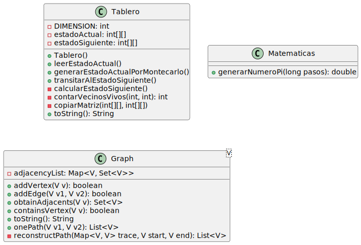

# Pruebas de Evaluación 1

Este repositorio contiene las implementaciones de las tres prácticas de evaluación.

## 🚀 Tabla de Contenidos

- [🧑‍💻 Práctica 1: Aproximación a π con Montecarlo](#práctica-1-aproximación-a-π-con-montecarlo)
- [🎮 Práctica 2: Juego de la Vida de Conway](#práctica-2-juego-de-la-vida-de-conway)
- [🔗 Práctica 3: Distancia entre Dos Grafos](#práctica-3-distancia-entre-dos-grafos)
- [📦 Instalación](#instalación)
- [📊 Análisis de Complejidad](#análisis-de-complejidad)
- [💡 Contribuciones](#contribuciones)
- [📄 Licencia](#licencia)

---

## 🧑‍💻 Práctica 1: Aproximación a π con Montecarlo

Esta práctica implementa una aproximación al número π utilizando el método de Montecarlo. Se generan puntos aleatorios dentro de un cuadrado y se cuenta la proporción de puntos que caen dentro de un círculo unitario inscrito en dicho cuadrado.

### 📈 Complejidad:

- **Temporal**: O(n), donde *n* es el número de puntos generados.
- **Espacial**: O(1), ya que solo se almacenan unas pocas variables.

---

## 🎮 Práctica 2: Juego de la Vida de Conway

Implementación del famoso autómata celular propuesto por John Conway. Se utiliza una matriz para representar las células, que evolucionan en cada iteración siguiendo reglas predefinidas.

### 📈 Complejidad:

- **Temporal**: O(m × n) por iteración, donde *m* y *n* son las dimensiones de la cuadrícula.
- **Espacial**: O(m × n), ya que se almacena el estado de la cuadrícula en memoria.

---

## 🔗 Práctica 3: Distancia entre Dos Grafos

Se implementa un algoritmo para calcular la distancia entre dos grafos, basada en la cantidad mínima de operaciones necesarias para transformar un grafo en otro.

### 📈 Complejidad:

- **Temporal**: Dependiendo del algoritmo, puede variar entre O(n²) y O(n³), donde *n* es el número de nodos.
- **Espacial**: O(n²), ya que se suele utilizar una matriz de adyacencia.

---

## 📦 Instalación

1. **Requisitos**:

   - Java Development Kit (JDK) 8 o superior.
   - Herramienta de compilación (Maven o línea de comandos).

2. **Compilación**:

   ```bash
   javac -d bin src/**/*.java
## 📋 Diagrama de Clases:

   


